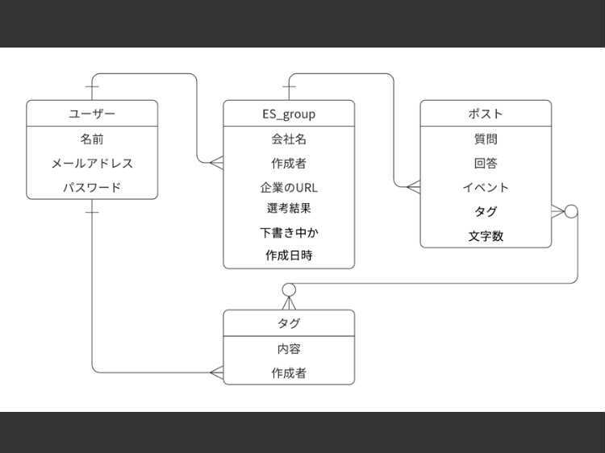
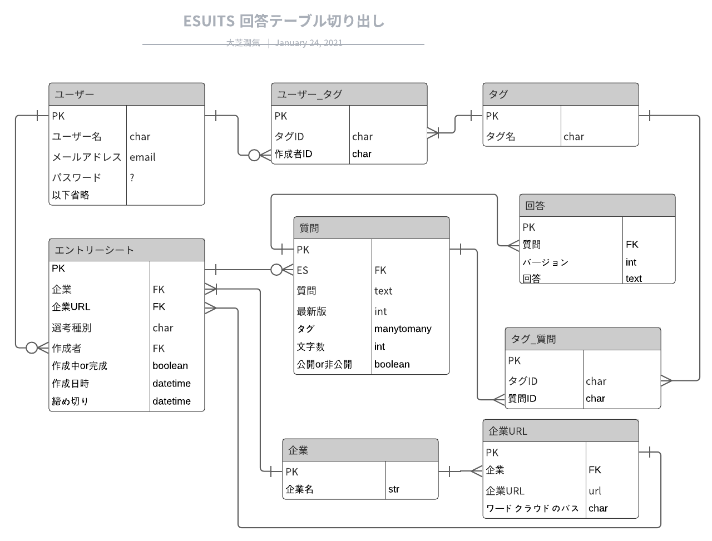
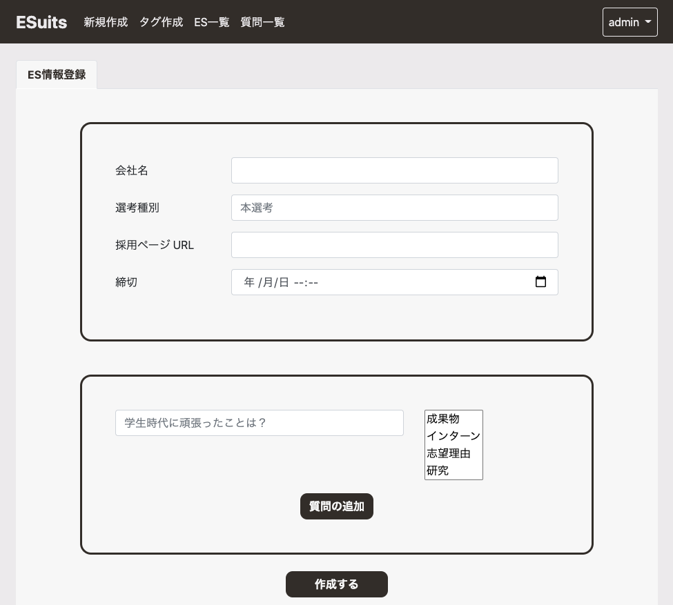

# JPHACKS(ハッカソン)で開発した[ESUITS](https://github.com/jphacks/D_2014)を個人で追加開発
- ハッカソン開発時のリポジトリは[こちら](https://github.com/jphacks/D_2014)
- ESUITSデプロイ先 → https://esuits.herokuapp.com/
## ハッカソンで自身が担当したところ
- Djangoを使用したアプリケーションの枠組み作成
- Herokuにデプロイ

## ハッカソン後に個人で取り組んだこと
### 取り組んだこと一覧
- データーベースの再設計とそれに伴うアプリケーションの修正
- 不具合の修正
- 新規機能の実装
    - 文字数カウント [#9](https://github.com/junkhp/esuiets_junki/issues/9)
    - 履歴機能 [#11](https://github.com/junkhp/esuiets_junki/issues/11)
- Docker環境構築とAWSにデプロイ(現在取り組んでいること)
https://github.com/junkhp/esuits_docker
## データベースの再設計とアプリケーションの修正
ハッカソンでは時間がなくデータベースの設計が割と適当だったのであらためて設計し直して適用．

### データベースの再設計
変更前

変更後
 

ポイント
- ユーザーとタグを多対多にした．(以前は一対多)
- エントリーシートのテーブルから企業テーブルと企業URLテーブルを分離

# アプリケーションそのものの修正
モデルの設計は完了したが，それに伴いアプリそのものを修正しないといけないので修正した．
大きな変更が以下の2点
- ユーザーとタグが多対多の場合の、タグを新規作成したときの処理の流れ
- エントリーシートを新規作成するときの流れ(企業テーブルと企業URLテーブルが分離したことによってどうなるのか)
## ユーザーとタグが多対多の場合、タグを作成したときの処理の流れ
### シチュエーション
- ユーザーを追加するときには，そのユーザーはタグをもっていないから特に気にすることはない(できれば新規ユーザーにも幾つかデフォルトのタグを与えたい)
- 各ユーザーは必要に応じて自分でタグを作成する．

### 処理フロー
1. ユーザーがタグを作成
1. タグテーブルにそのタグがすでにあるときはそのレコードを取得，ないときはレコードを新規作成
1. ユーザーとタグの中間テーブルにレコードを新規作成

## 新しくエントリーシートを追加するときはどうしたらいいのか
### シチュエーション
- ユーザーはエントリーシートを新規作成
- エントリーシートの内容(抜粋, ES情報登録の画像参照)
    * 企業名
    * 採用ページURL
    * 質問(複数)

### 処理フロー
1. 企業テーブルにおいて企業名でレコードを検索．ない場合は新規作成
1. 企業URLテーブルにおいて3.で取得した企業ID(PK)と企業URLでレコードを検索．ない場合は新規作成．
1. エントリーシートテーブルにエントリーシートそのものを作成
1. 5.で作成したエントリーシートのレコードに紐付けて，質問を質問テーブルに保存

 